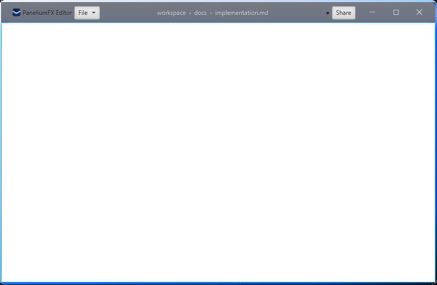

# Platinum Chrome - Implementation

`PaneliumFX` can turn a JavaFX window into an undecorated, transparent window with its
own frame (`ChromePane`) around the actual content: drop shadow, border, a composable
caption bar and the content area.

## Add the dependency

The artifacts are published to Maven Central under the group `org.pcsoft.framework`.

=== "Gradle (Kotlin DSL)"

    ```kotlin
    dependencies {
        implementation("org.pcsoft.framework:panelium:0.2.0")
    }
    ```

=== "Maven"

    ```xml
    <dependency>
        <groupId>org.pcsoft.framework</groupId>
        <artifactId>panelium</artifactId>
        <version>0.2.0</version>
    </dependency>
    ```

JavaFX (`javafx.controls`, version 25 or newer, Java 25 or newer) is exposed
transitively, so no additional JavaFX dependency is required for the public API types.
Loading `ChromePane` or `ChromeCaptionBar` from FXML additionally requires the
`javafx.fxml` module on the module path.

## Entry points

There are three entry points, all producing the same frame structure via a shared
configuration routine:

- `PaneliumChrome.install(stage)` - converts an existing `Stage` before it is shown; the
  current scene root becomes the chrome's content. Returns the created `ChromePane`.
- `PaneliumStage` - a `Stage` subclass that is already preconfigured with a `ChromePane`;
  set its `content` property to place your UI. Supports `initOwner`/`initModality` like
  any other `Stage`.
- `ChromePane` - the frame itself, for cases where you build the `Scene` and `Stage`
  manually, or as the root element of an FXML file.

!!! warning
    `PaneliumChrome.install(stage)` must be called before `Stage.show()`. It switches the
    stage to `StageStyle.TRANSPARENT` and installs a new transparent `Scene`.

Every example below shows the Kotlin variant and the equivalent FXML variant side by
side. In the FXML variant, `ChromePane` (`@DefaultProperty("content")`) or
`ChromeCaptionBar` is placed directly in the FXML file - either as the file's root
element or via the `<fx:root>` pattern - and loaded with `FXMLLoader`.

## PaneliumStage

`PaneliumStage` bootstraps the `Stage` itself, so it stays Kotlin code; the content
placed on it can still come from FXML.

```kotlin
val stage = PaneliumStage()
stage.content = Label("Hello, PaneliumFX!")
stage.show()
```

## PaneliumChrome.install

`PaneliumChrome.install(stage)` also bootstraps the `Stage`, but the scene root it wraps
can equally be built in Kotlin or loaded from FXML.

```kotlin
val stage = Stage()
stage.scene = Scene(buildRoot())
val chrome = PaneliumChrome.install(stage)
stage.show()
```

## ChromePane

=== "Kotlin"

    ```kotlin
    val chrome = ChromePane(Label("Hello, PaneliumFX!"))
    val scene = Scene(chrome)
    scene.fill = Color.TRANSPARENT

    val stage = Stage()
    stage.initStyle(StageStyle.TRANSPARENT)
    stage.scene = scene
    stage.show()
    ```

=== "FXML"

    ```xml
    <?import javafx.scene.control.Label?>
    <?import org.pcsoft.framework.panelium.chrome.ChromePane?>

    <ChromePane xmlns:fx="http://javafx.com/fxml">
        <Label text="Hello, PaneliumFX!"/>
    </ChromePane>
    ```

    ```kotlin
    val chrome = FXMLLoader.load<ChromePane>(resource)
    val stage = Stage()
    stage.initStyle(StageStyle.TRANSPARENT)
    stage.scene = Scene(chrome).apply { fill = Color.TRANSPARENT }
    chrome.attachStage(stage)
    stage.show()
    ```

The content can be replaced at runtime through the `content` property (or
`contentProperty()` for binding).

Once the frame is attached to a `Stage`, the usual window operations (move, resize,
maximize, full screen) are handled by the frame itself - no additional wiring is
required. Resizing honours `Stage.isResizable` and the `minWidth`/`minHeight`/
`maxWidth`/`maxHeight` constraints of the `Stage`.

## Content and caption slots

The caption bar (`ChromePane.captionBar`, a `ChromeCaptionBar`) has three content slots,
each an `ObservableList<Node>`:

- `captionLeftItems` - leading edge, after the default icon and title
- `captionCenterItems` - horizontally growing center region
- `captionRightItems` - trailing edge, before the caption buttons

=== "Kotlin"

    ```kotlin
    val chrome = ChromePane(buildRoot())
    chrome.captionCenterItems.add(Label("Untitled"))
    chrome.captionRightItems.add(Button("Sign in"))
    ```

=== "FXML"

    ```xml
    <?import javafx.scene.control.Button?>
    <?import javafx.scene.control.Label?>
    <?import org.pcsoft.framework.panelium.chrome.ChromePane?>

    <ChromePane xmlns:fx="http://javafx.com/fxml">
        <captionCenterItems>
            <Label text="Untitled"/>
        </captionCenterItems>
        <captionRightItems>
            <Button text="Sign in"/>
        </captionRightItems>
    </ChromePane>
    ```

A default title node (bound to `Stage.title`) and a default icon node (bound to the first
image in `Stage.icons`) are shown in the leading slot. Switch either off with
`isDefaultTitleVisible` / `isDefaultIconVisible` (or their `*Property()` accessors):

=== "Kotlin"

    ```kotlin
    chrome.isDefaultTitleVisible = false
    ```

=== "FXML"

    ```xml
    <ChromePane xmlns:fx="http://javafx.com/fxml" defaultTitleVisible="false">
        ...
    </ChromePane>
    ```

### Drag regions and passthrough

The caption background is the window drag zone; interactive controls you add to a slot keep
their own clicks. For nodes where the heuristic guesses wrong, override it with the attached
property `ChromeCaptionBar.setDragRegion(node, value)`:

- `true` - the node drags the window even though it is interactive (a filled toolbar strip)
- `false` - the node never drags, even though it looks inert (a custom hit target)
- `null` - clear the override and fall back to the heuristic (the default)

=== "Kotlin"

    ```kotlin
    val strip = HBox(Label("Project"), Separator(), Label("main"))
    ChromeCaptionBar.setDragRegion(strip, true)
    chrome.captionCenterItems.add(strip)
    ```

=== "FXML"

    ```xml
    <?import javafx.scene.control.Label?>
    <?import javafx.scene.control.Separator?>
    <?import javafx.scene.layout.HBox?>
    <?import org.pcsoft.framework.panelium.chrome.ChromeCaptionBar?>

    <captionCenterItems>
        <HBox ChromeCaptionBar.dragRegion="true">
            <Label text="Project"/>
            <Separator/>
            <Label text="main"/>
        </HBox>
    </captionCenterItems>
    ```

The flag is resolved from the node under the pointer upwards; the first node carrying one
decides.

### Window buttons

The minimize / maximize-restore / close buttons are added automatically when the frame is
attached to a `Stage` (through any of the three entry points). They occupy the caption's
reserved button slot, so they always stay outside the `captionRightItems` /
`captionLeftItems` you add yourself.

Placement and native look follow the host operating system: on Windows, Linux and any
other platform the buttons sit on the trailing edge in the order minimize, maximize, close,
with the default icon and title on the leading edge; on macOS they sit on the leading edge
in the order close, minimize, zoom, and the default icon and title move to the trailing
edge.

Override the detected OS with `captionOsProperty()` (or the `captionOs` property) - useful
for tests, demos and cross-platform previews:

=== "Kotlin"

    ```kotlin
    val chrome = PaneliumStage().apply { content = buildRoot() }
    chrome.chromePane.captionOs = ChromeOs.MAC
    ```

=== "FXML"

    ```xml
    <?import org.pcsoft.framework.panelium.chrome.ChromeOs?>
    <?import org.pcsoft.framework.panelium.chrome.ChromePane?>

    <ChromePane xmlns:fx="http://javafx.com/fxml" captionOs="MAC">
        ...
    </ChromePane>
    ```

## Complex example

A full editor-style window: `PaneliumStage` as the entry point, all three caption
slots filled, a draggable breadcrumb strip in the center, interactive controls on the
trailing edge, a forced OS look for a cross-platform preview, an attached application
stylesheet and a runtime content swap.



=== "Kotlin"

    ```kotlin
    class EditorApp : Application() {

        override fun start(primaryStage: Stage) {
            val stage = PaneliumStage()
            stage.title = "PaneliumFX Editor"
            stage.icons.add(Image(javaClass.getResourceAsStream("/app/icon.png")))
            stage.width = 900.0
            stage.height = 600.0
            stage.minWidth = 640.0
            stage.minHeight = 420.0

            val chrome = stage.chromePane

            // Force the Windows layout regardless of the host OS (demo / preview).
            chrome.captionOs = ChromeOs.WINDOWS

            // Leading slot: a menu-like button next to the default icon and title.
            chrome.captionLeftItems.add(MenuButton("File", null,
                MenuItem("New"), MenuItem("Open…"), MenuItem("Save")))

            // Center slot: a breadcrumb that still drags the window.
            val breadcrumb = HBox(6.0,
                Label("workspace"), Label("›"), Label("docs"), Label("›"),
                Label("implementation.md")).apply {
                alignment = Pos.CENTER
                styleClass.add("breadcrumb")
            }
            ChromeCaptionBar.setDragRegion(breadcrumb, true)
            chrome.captionCenterItems.add(breadcrumb)

            // Trailing slot: live controls, kept clickable by the heuristic.
            val dirty = Label("●")
            chrome.captionRightItems.addAll(dirty, Button("Share"))

            // Content, swapped at runtime.
            val welcome = Label("Open a file to start editing")
            val editor = TextArea()
            stage.content = welcome

            editor.textProperty().addListener { _, _, _ -> dirty.text = "● unsaved" }

            Platform.runLater {
                stage.content = editor          // contentProperty() also supports binding
                editor.requestFocus()
            }

            stage.scene.stylesheets.add(
                javaClass.getResource("/app/editor-chrome.css").toExternalForm())

            stage.show()
        }
    }
    ```

=== "FXML"

    ```xml
    <?import javafx.scene.control.Button?>
    <?import javafx.scene.control.Label?>
    <?import javafx.scene.control.MenuButton?>
    <?import javafx.scene.control.MenuItem?>
    <?import javafx.scene.control.TextArea?>
    <?import javafx.geometry.Pos?>
    <?import javafx.scene.layout.HBox?>
    <?import org.pcsoft.framework.panelium.chrome.ChromeCaptionBar?>
    <?import org.pcsoft.framework.panelium.chrome.ChromePane?>

    <ChromePane xmlns:fx="http://javafx.com/fxml" captionOs="WINDOWS">
        <captionLeftItems>
            <MenuButton text="File">
                <items>
                    <MenuItem text="New"/>
                    <MenuItem text="Open&#8230;"/>
                    <MenuItem text="Save"/>
                </items>
            </MenuButton>
        </captionLeftItems>
        <captionCenterItems>
            <HBox spacing="6.0" styleClass="breadcrumb" ChromeCaptionBar.dragRegion="true">
                <alignment><Pos fx:constant="CENTER"/></alignment>
                <children>
                    <Label text="workspace"/>
                    <Label text="&#8250;"/>
                    <Label text="docs"/>
                    <Label text="&#8250;"/>
                    <Label text="implementation.md"/>
                </children>
            </HBox>
        </captionCenterItems>
        <captionRightItems>
            <Label text="&#9679;"/>
            <Button text="Share"/>
        </captionRightItems>
        <content>
            <TextArea/>
        </content>
    </ChromePane>
    ```

    ```kotlin
    val chrome = FXMLLoader.load<ChromePane>(
        javaClass.getResource("/app/editor.fxml"))
    val stage = Stage()
    stage.initStyle(StageStyle.TRANSPARENT)
    stage.title = "PaneliumFX Editor"
    stage.scene = Scene(chrome).apply {
        fill = Color.TRANSPARENT
        stylesheets.add(javaClass.getResource("/app/editor-chrome.css").toExternalForm())
    }
    chrome.attachStage(stage)
    stage.show()
    ```
